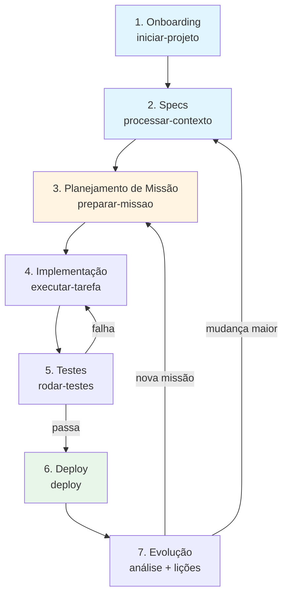

# Macro Processo do Negócio — cocreate-project-template (EXEMPLO)

> **Este é um exemplo de output da skill `/iniciar-projeto`**, fase 4.
> Mostra como o macro processo fica após o usuário descrever as etapas do negócio.
> Use como referência ao revisar o macro processo real gerado para seu projeto em `docs/macro-processo.md`.

---

## Visão Sistêmica

## Etapas

### 1. Onboarding (`iniciar-projeto`)

- **Atores**: Usuário (estrategista/dev), IA (Claude Code ou Codex)
- **Inputs**: Vontade de iniciar projeto novo; (opcional) briefing prévio em `docs/raw/`
- **Outputs**: `docs/raw/00-perfil-projeto.md` + `docs/macro-processo.md` + `CLAUDE.md` preenchido (perfil + tipo + stakeholders)
- **Sistemas envolvidos**: Claude Code ou Codex CLI, sistema de arquivos local, (opcional) `~/.claude/CLAUDE.md` global
- **IA agrega valor em**: Conduzir perguntas guiadas, interpretar respostas em linguagem natural, gerar artefatos estruturados
- **Métrica de sucesso**: Usuário sai com briefing + macro processo prontos, sem ter precisado "pensar a estrutura" sozinho. Tempo médio: 20-40 min.

### 2. Geração de Specs (`processar-contexto`)

- **Atores**: Usuário (revisor), IA (gerador)
- **Inputs**: Briefing em `docs/raw/` + macro processo + CLAUDE.md preenchido
- **Outputs**: `spec-000-constitution.md` (visão, princípios, glossário, entidades) + `spec-001-*.md` (primeira spec de feature ou arquitetura) + ADRs iniciais
- **Sistemas envolvidos**: Claude Code/Codex, templates em `docs/specs/` e `docs/adr/`
- **IA agrega valor em**: Extrair entidades/relacionamentos do briefing, gerar diagramas Mermaid, sugerir stack baseada no domínio
- **Métrica de sucesso**: Constitution gerada precisa de ≤3 rodadas de revisão para ficar "boa para implementar". Tempo médio: 30-60 min.

### 3. Planejamento de Missão (`preparar-missao`)

- **Atores**: Usuário (decisor de prioridade), IA (recomendador de modo)
- **Inputs**: Direção do usuário (voz ou texto) + estado atual em CLAUDE.md
- **Outputs**: Seção "Missão Corrente" atualizada no CLAUDE.md + recomendação de modo (Rápido ou Orquestrado) + lista de skills a invocar
- **Sistemas envolvidos**: Claude Code/Codex
- **IA agrega valor em**: Classificar complexidade, minimizar número de skills usadas, garantir que estado da sessão é registrado
- **Métrica de sucesso**: Tempo médio de planejamento < 5 min. Usuário sempre sabe "o que vamos fazer agora" sem precisar relembrar contexto.

### 4. Implementação (`executar-tarefa`)

- **Atores**: Usuário (revisor), IA (executora técnica), MCPs (Context7 para docs)
- **Inputs**: Spec + missão definida
- **Outputs**: Código (backend, frontend, infra) + testes + atualizações em CLAUDE.md
- **Sistemas envolvidos**: Stack do projeto, Git, MCPs
- **IA agrega valor em**: Geração de código alinhada à spec, busca de docs atualizadas via Context7, sugestão de melhorias enquanto implementa
- **Métrica de sucesso**: Código entregue passa nos testes na primeira execução em >70% dos casos. Conformidade com a spec validada por `analisar-coerencia`.

### 5. Testes (`rodar-testes`)

- **Atores**: Usuário (interpreta resultado), IA (executa e analisa falhas)
- **Inputs**: Suite de testes em `tests/`
- **Outputs**: Relatório de pass/fail + (se falha) análise da causa raiz
- **Sistemas envolvidos**: pytest, jest, ou equivalente
- **IA agrega valor em**: Análise de stack traces, sugestão de fix, identificação de testes faltantes
- **Métrica de sucesso**: Cobertura > 70% em código crítico. Falhas têm causa raiz identificada em < 10 min.

### 6. Deploy (`deploy`)

- **Atores**: Usuário (autorizador), IA (executa scripts)
- **Inputs**: Código testado + scripts em `scripts/`
- **Outputs**: Aplicação em produção (Google Cloud Run, Vercel, etc.) + smoke test pós-deploy
- **Sistemas envolvidos**: GCP/Azure/Vercel, Docker, GitHub Actions
- **IA agrega valor em**: Executar scripts pré-validados, monitorar logs pós-deploy, sugerir rollback se necessário
- **Métrica de sucesso**: Deploy bem-sucedido na primeira tentativa > 90%. Tempo de deploy < 10 min.

### 7. Evolução (análise + `licoes-aprendidas`)

- **Atores**: Usuário (reflexivo), IA (documentadora)
- **Inputs**: Output de fase concluída + observações do usuário
- **Outputs**: Lições aprendidas em formato Regra de Diamante + atualização de specs se necessário + nova missão
- **Sistemas envolvidos**: `docs/specs/`, `docs/adr/`, CLAUDE.md
- **IA agrega valor em**: Identificar padrões em múltiplas lições, sugerir refactor de spec quando lições convergem
- **Métrica de sucesso**: Cada falha gera ≥1 lição documentada. Lições reduzem reincidência de erros similares em sessões futuras.

## Pontos de IA / Automação

| Etapa | Função da IA | Status |
|-------|--------------|--------|
| 1. Onboarding | Perguntas guiadas + extração de campos | Em uso |
| 2. Specs | Geração + diagramas Mermaid + sugestão de stack | Em uso |
| 3. Planejamento | Classificação de complexidade + seleção de skills | Em uso |
| 4. Implementação | Geração de código + busca via Context7 | Em uso |
| 5. Testes | Análise de falhas + sugestão de fix | Em uso |
| 6. Deploy | Execução de scripts + monitoramento de logs | Em uso (limitado) |
| 7. Evolução | Identificação de padrões em lições | Planejado |

## Gargalo Atual

**Etapa**: 2 (Geração de specs) — primeira execução

**Por que é gargalo**: A qualidade da spec-000 depende inteiramente da riqueza do briefing. Quando o usuário pula direto para `/processar-contexto` sem rodar `/iniciar-projeto`, a constitution gerada fica genérica e exige múltiplas rodadas de revisão.

**Mitigação prevista**: Skill `/processar-contexto` tem guarda que detecta briefing pobre e sugere rodar `/iniciar-projeto` antes. Ver `processar-contexto/SKILL.md` linhas 14-27.

## Conexões com Specs

| Etapa | Spec(s) relacionada(s) |
|-------|------------------------|
| 1. Onboarding | `spec-000-constitution.md` (entrada via `docs/raw/00-perfil-projeto.md`) |
| 2. Specs | `spec-000-constitution.md`, `spec-001-*.md` |
| 3-4. Planejamento + Implementação | `spec-NNN-feature-X.md` (cada feature tem sua spec) |
| 5-6. Testes + Deploy | Critérios de aceitação dentro de cada spec |
| 7. Evolução | Atualização de specs + ADRs |

## Evolução do Documento

| Data | Versão | Mudança | Autor |
|------|--------|---------|-------|
| 2026-05-13 | v0.1 | Exemplo inicial criado como referência didática | Rodrigo + IA |

---

> **Como este exemplo foi gerado**: imaginando a sessão real de `/iniciar-projeto` fase 4 aplicada ao próprio template. Cada etapa do diagrama corresponde a uma skill do template. Note como o macro processo descreve o **uso do template**, não a **arquitetura técnica** dele. É a diferença crítica entre macro processo (negócio/uso) e arquitetura (técnica).
