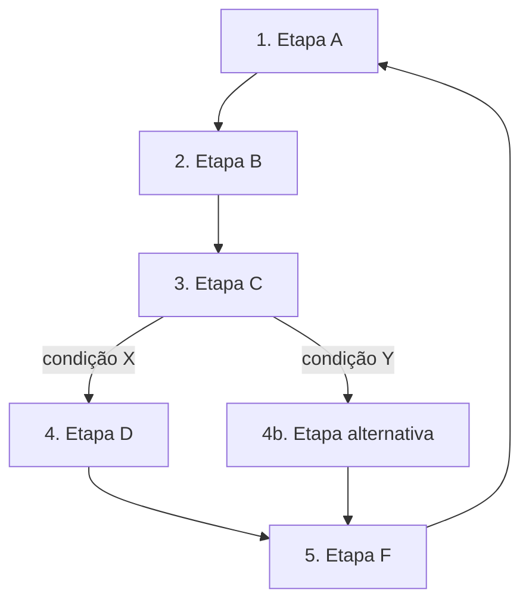

# Banco de Perguntas — Macro Processo do Negócio

> Este arquivo é parte do template **cocreate-project-template** (metodologia SDD da CoCreate AI).
> É consumido pelas skills `/iniciar-projeto` (Claude Code) e `iniciar-projeto` (Codex).
> Também serve como artefato pedagógico independente.

## Propósito

Construir um **diagrama Mermaid do macro processo do negócio** — não da arquitetura técnica, e sim do **fluxo do negócio**: quais etapas o negócio executa, quem participa, quais são os inputs e outputs.

Por que isso importa:
- **Clareza imediata** — em uma página o time entende o que o projeto faz no mundo real
- **Calibragem da arquitetura** — sistemas técnicos atendem processos, não o contrário
- **Artefato pedagógico** — alunos veem a visão sistêmica antes da implementação

## Quando aplicar

- Após escopo inicial ([escopo-inicial.md](escopo-inicial.md))
- O resultado vai pra `docs/macro-processo.md` (arquivo dedicado, evolutivo)

## Onde salvar a resposta

Arquivo `docs/macro-processo.md` — usando o template em `docs/macro-processo.template.md`.

---

## Perguntas

### Bloco 1 — Etapas principais

1. **Quais são as 3 a 7 etapas principais do processo do negócio?** Pense em etapas grandes (não tarefas micro). Exemplos por categoria:
   - **SaaS**: descoberta → cadastro → onboarding → uso recorrente → renovação
   - **dMRV (carbono)**: cadastro de projeto → coleta de dados → validação → emissão de crédito → comercialização
   - **Curso**: matrícula → consumo do conteúdo → exercícios → avaliação → certificação
   - **Consultoria**: descoberta → diagnóstico → proposta → execução → entrega
   - **Plataforma de dados**: ingestão → transformação → enriquecimento → exposição → consumo

### Bloco 2 — Para CADA etapa

Para cada uma das etapas identificadas, capture:

2. **Quem participa (atores)?** Pode ser pessoa, papel, sistema externo, agente IA, etc.
3. **Que inputs entram nessa etapa?** Dados, decisões, eventos, documentos.
4. **Que outputs saem dessa etapa?** O que precisa estar pronto pra próxima etapa começar.
5. **Que sistemas/ferramentas suportam?** Software interno, SaaS terceiros, planilhas, e-mail, chat.
6. **Onde IA agrega valor (ou pode agregar)?** Automação, sugestão, validação, geração, classificação.

### Bloco 3 — Conexões e exceções

7. **Há etapas paralelas?** Ou tudo é estritamente sequencial?
8. **Há retornos (loops)?** Ex: validação rejeita e volta pra etapa anterior.
9. **Há decisões críticas (branches)?** Pontos onde o processo bifurca dependendo de uma condição.

### Bloco 4 — Métrica do processo

10. **Como o sucesso de cada etapa é medido?** Métrica simples (ex: tempo médio, taxa de aprovação, satisfação).
11. **Qual etapa é o GARGALO atual ou esperado?** Onde o processo trava ou fica caro.

---

## Output esperado

A skill deve gerar `docs/macro-processo.md` usando o template em `docs/macro-processo.template.md`:

```markdown
# Macro Processo do Negócio — {{PROJECT_NAME}}

## Visão Sistêmica



## Etapas

### 1. {{ETAPA}}
- **Atores**: ...
- **Inputs**: ...
- **Outputs**: ...
- **Sistemas envolvidos**: ...
- **IA agrega valor em**: ...
- **Métrica de sucesso**: ...

### 2. {{ETAPA}}
...

## Pontos de IA / Automação
[Mapa consolidado de onde IA entra]

## Gargalo Atual
[Etapa que prende ou é cara]

## Evolução do Documento
[Log de revisões: data + o que mudou]
```

## Exemplos de resposta

### Exemplo A — Plataforma dMRV de biochar

Etapas: cadastro de projeto → coleta de dados de produção → validação técnica → cálculo do crédito → emissão e tokenização → comercialização → relatório de impacto.

Atores variados: produtor, validador, validador externo, registro, comprador, auditor.

IA agrega valor em: coleta automatizada (visão computacional), validação automática de dados, geração de relatórios.

### Exemplo B — Curso de SDD

Etapas: matrícula → onboarding (perfil do aluno) → módulos teóricos → exercícios práticos → entrega de projeto final → revisão → certificação.

Atores: aluno, instrutor, mentor de pares, sistema (LMS), Claude Code/Codex.

IA agrega valor em: feedback automático em exercícios, geração de templates, revisão de projeto final.

## Como aplicar (instruções pro agente)

1. Faça a pergunta 1 isoladamente (etapas) e **espere o usuário responder antes de avançar** — esse é o esqueleto do processo.
2. Quando tiver as etapas, faça o bloco 2 (atores/inputs/outputs/sistemas/IA) **uma etapa por vez**, mas apresente todas as perguntas dessa etapa de uma vez.
3. Pergunte sobre conexões e exceções (bloco 3) só DEPOIS de mapear todas as etapas em isolado.
4. **Construa o diagrama Mermaid de forma incremental** — mostre ao usuário a primeira versão e peça correção, em vez de pedir o usuário pra "descrever um diagrama".
5. Gere o arquivo `docs/macro-processo.md` e mostre o resultado antes de salvar.
6. Lembre o usuário: **este arquivo é EVOLUTIVO**. Pode ser refinado a qualquer momento. A primeira versão não precisa ser perfeita.

## Notas sobre Mermaid

- Prefira `flowchart TD` (top-down) para processos lineares
- Use `flowchart LR` (left-right) se houver muitas etapas paralelas
- Para jornadas com fases temporais, considere `journey`
- Para processos com atores claros, considere `sequenceDiagram`
- Para subprocessos, use `subgraph`
- Limite cores e ícones na v1 — clareza vale mais que estética
