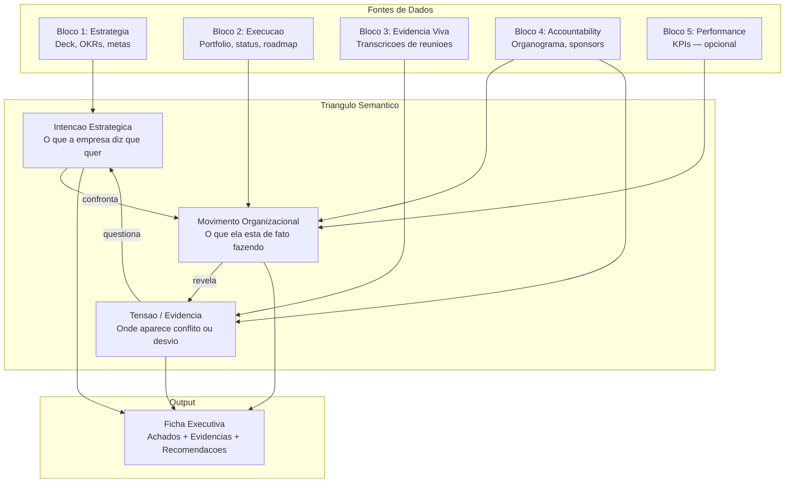
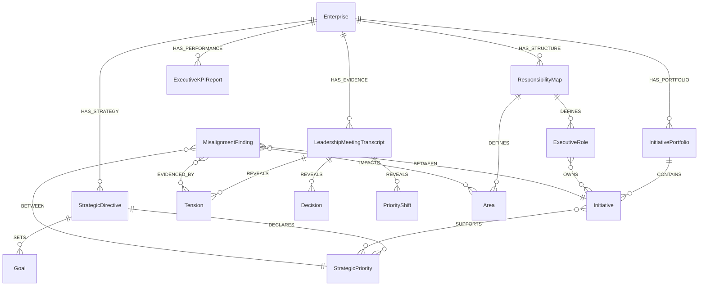
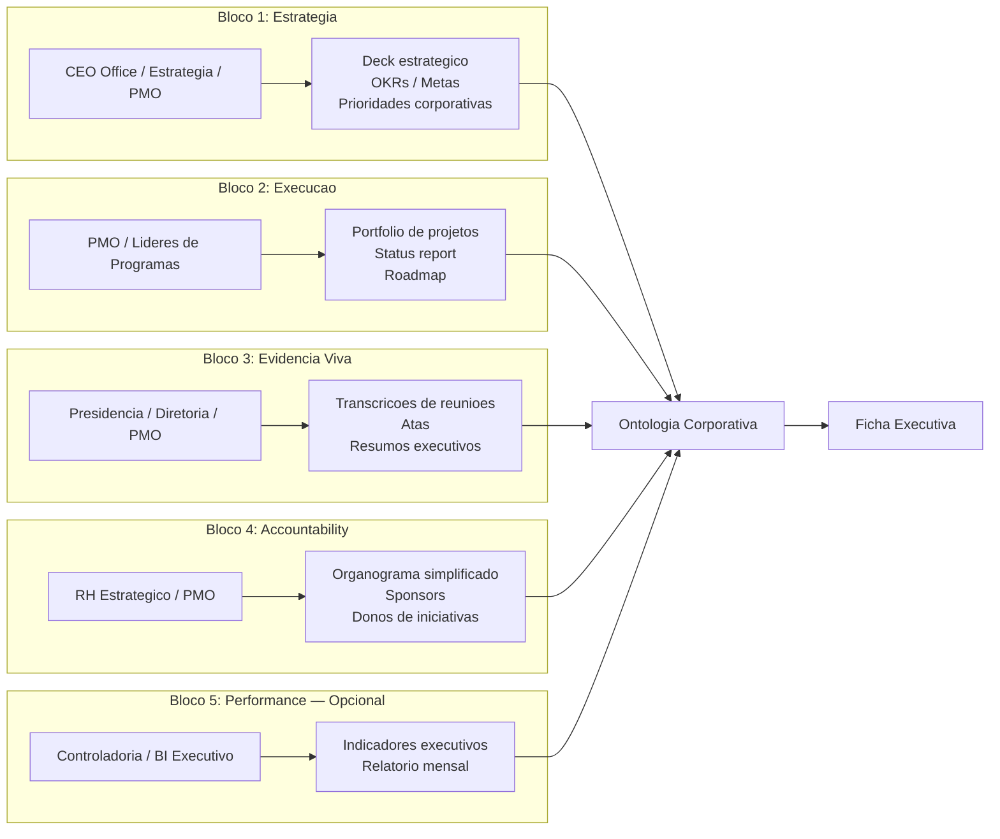

# Spec 000 — Constitution: EK.OS

**Criado**: 2026-03-31 | **Status**: Draft
**Prioridade**: P0 | **Dependencias**: Nenhuma (documento raiz)

---

## 1. Visao e Missao

### Visao

Ser o sistema de inteligencia organizacional proativa que elimina a cegueira gerencial nas empresas brasileiras, transformando evidencias corporativas em clareza estrategica atraves de grafos semanticos e IA.

### Missao

Construir o produto enterprise que:
- **Detecta** desalinhamentos entre estrategia declarada e execucao real
- **Antecipa** riscos e oportunidades antes que o board os perceba
- **Conecta** decisoes a impactos reais em pessoas, processos e resultados
- **Elimina** dependencias criticas invisiveis e gargalos decisorios

### Proposta de Valor em Uma Frase

> "Nos identificamos, com evidencias, onde a execucao da sua empresa ja esta desalinhada da estrategia, quais impactos isso gera e quais pontos exigem intervencao executiva imediata."

---

## 2. Principios Fundamentais

### P1 — Inteligencia Proativa, Nao Reativa

EK.OS entrega inteligencia sem que o executivo precise perguntar. Nao e chatbot. Nao e dashboard. E um sistema que gera entregas estrategicas de forma autonoma.

### P2 — Evidencia Rastreavel

Toda afirmacao do sistema aponta para a evidencia de origem: documento, transcricao, indicador. O board precisa confiar, e confianca vem de rastreabilidade.

### P3 — Friccao Minima de Entrada

O assessment comeca com 4 evidencias corporativas que ja existem. Nao pedimos acesso a empresa toda. Pedimos o minimo que gera maximo valor.

### P4 — Grafo Invisivel, Valor Visivel

O motor semantico (ontologia + Neo4j) e invisivel para o comprador. O que ele ve e a ficha, o radar, o mapa. O grafo e infraestrutura, nao argumento de venda.

### P5 — Ontologia como Epicentro

Tudo nasce da ontologia corporativa. Ela modela intencao estrategica, movimento organizacional e tensoes. Sem ontologia, nao ha inteligencia — apenas dados.

### P6 — Expansao por Valor, Nao por Escopo

O produto entra com 1 feature (Detector). Expande para 5. Cada expansao e justificada pelo valor comprovado da anterior.

---

## 3. Glossario Canonico

| Termo | Definicao | Uso Correto | Uso Incorreto |
|-------|-----------|-------------|---------------|
| **EK.OS** | Enterprise Knowledge Operation System — sistema de inteligencia organizacional proativa | "EK.OS detectou 3 desalinhamentos" | "Nosso software EK.OS" (nao e apenas software) |
| **EKS** | Enterprise Knowledge System — conceito/disciplina mais ampla de conhecimento empresarial | "EK.OS e construido sobre a abordagem EKS" | Confundir EKS (disciplina) com EK.OS (produto) |
| **Ontologia Corporativa** | Modelagem estruturada do conhecimento organizacional: entidades, relacoes, intencoes, tensoes | "A ontologia corporativa modela a estrutura de decisao" | "Ontologia" isolado sem contexto |
| **Ficha Executiva** | Entregavel principal do EK.OS — documento estruturado com achados, evidencias e recomendacoes | "Ficha de Desalinhamento Estrategico" | "Relatorio" (generico demais) |
| **Assessment** | Processo inicial de coleta e analise das 4 evidencias corporativas | "Tudo comeca com o assessment" | Confundir com auditoria ou consultoria |
| **Bloco de Upload** | Conjunto tematico de documentos agrupados por custodiante | "Bloco 3: Evidencia Viva" | "Upload de documentos" (generico) |
| **Intencao Estrategica** | O que a empresa diz que quer — extraido de docs de estrategia, OKRs, metas | "Intencao: crescer 30% em receita" | — |
| **Movimento Organizacional** | O que a empresa esta de fato fazendo — extraido de portfolio, projetos, status | "Movimento: 60% dos projetos nao relacionados a meta" | — |
| **Tensao** | Conflito, atraso, desvio ou ambiguidade detectada nas evidencias vivas | "Tensao: mudanca de prioridade recorrente no comite" | — |
| **Triangulo Semantico** | Modelo ontologico central: Intencao x Movimento x Tensao | "O Triangulo Semantico e o motor de deteccao" | — |
| **Detector de Desalinhamento** | Champion feature — cruza estrategia, execucao e evidencias para detectar desvios | "Detector apontou desalinhamento entre OKR2 e area X" | "Detector de erros" |
| **Inteligencia Proativa** | IA que gera entregas sem ser perguntada — o oposto de chatbot | "Entregas proativas de inteligencia" | "IA conversacional" |
| **Industry Pack** | Camada de configuracao vertical (templates de ontologia + KPIs por setor) | "Industry Pack Financeiro" | Confundir com produto separado |

---

## 4. Modelo Central: Triangulo Semantico

O EK.OS opera sobre tres camadas semanticas que, cruzadas, revelam desalinhamentos:

### Precisao do Modelo

O segredo nao e coletar documentos — e modelar tres coisas com precisao:

1. **Intencao Estrategica**: O que a empresa diz que quer (extraido de estrategia formal, OKRs, metas)
2. **Movimento Organizacional**: O que ela esta de fato fazendo (extraido de portfolio, projetos, status)
3. **Tensao**: Onde aparece conflito, atraso, dependencia, ambiguidade ou desvio (extraido de reunioes, evidencias vivas)

Se a ontologia capturar bem esse triangulo, nao e necessario um universo documental gigantesco.

---

## 5. Entidades Canonicas

### Tabela de Entidades

| Entidade | Descricao | Propriedades-chave |
|----------|-----------|-------------------|
| **Enterprise** | Empresa cliente do EK.OS | nome, setor, porte, assessment_date |
| **StrategicDirective** | Documento de estrategia formal | titulo, tipo, periodo, upload_date, bloco |
| **StrategicPriority** | Prioridade declarada pela empresa | descricao, peso, horizonte |
| **Goal** | OKR, meta ou indicador-alvo | descricao, metrica, valor_alvo, prazo |
| **InitiativePortfolio** | Base de projetos/iniciativas | fonte, data_extracao |
| **Initiative** | Projeto, programa ou iniciativa individual | nome, objetivo, sponsor, area, status, prazo |
| **LeadershipMeetingTranscript** | Transcricao de reuniao executiva | data, participantes, tipo_reuniao, duracao |
| **Tension** | Conflito ou tensao detectada nas evidencias | descricao, tipo, severidade, fonte |
| **Decision** | Decisao formalizada ou implicita | descricao, decisor, data, status |
| **PriorityShift** | Mudanca de prioridade detectada | de, para, motivo, evidencia |
| **ResponsibilityMap** | Estrutura organizacional minima | tipo (organograma/sponsors/owners) |
| **Area** | Area organizacional | nome, lider, nivel |
| **ExecutiveRole** | Papel executivo | nome, cargo, area, responsabilidades |
| **ExecutiveKPIReport** | Relatorio de indicadores | periodo, fonte, indicadores |
| **MisalignmentFinding** | Achado de desalinhamento (output) | descricao, severidade, evidencias, recomendacao |

### Tipos Documentais do MVP

| Tipo | Obrigatorio | Bloco | Descricao |
|------|-------------|-------|-----------|
| **StrategicDirective** | Sim | 1 | Planejamento estrategico, OKRs, metas, visao |
| **InitiativePortfolio** | Sim | 2 | Lista de projetos, owners, status, prazo |
| **LeadershipMeetingTranscript** | Sim | 3 | Transcricao ou ata de reunioes executivas |
| **ResponsibilityMap** | Sim | 4 | Organograma, sponsors, responsaveis |
| **ExecutiveKPIReport** | Opcional | 5 | Indicadores mensais/periodicos |
| Contract | Fase 2 | — | Contratos (risco contratual) |
| Policy | Fase 2 | — | Politicas internas |
| SOP | Fase 2 | — | Procedimentos operacionais |
| ProcessNarrative | Fase 2 | — | Narrativas de processo (colaborativo) |

---

## 6. As 5 Features Core

### 6.1 Detector de Desalinhamento Estrategico (Champion — MVP)

**Pergunta que responde**: "Estamos realmente executando a estrategia ou so produzindo atividade?"

Cruza estrategia declarada, OKRs, projetos, reunioes, decisoes, riscos, areas, orcamento e evidencias operacionais para apontar onde a empresa esta desviando do que ela propria disse que era prioridade.

**Output**: Ficha de Desalinhamento Estrategico

### 6.2 Radar Executivo de Risco e Oportunidade (Fase 2)

**Pergunta que responde**: "Quais mudancas exigem atencao do board agora, e por que?"

Combina sinais internos e externos para mostrar impacto potencial em margem, receita, operacao, clientes, compliance, cyber, reputacao e confianca.

### 6.3 Navegador de Impacto de Decisao (Fase 2)

**Pergunta que responde**: "Se aprovarmos esta decisao, o que realmente sera afetado?"

Mostra raio de impacto: processos, areas, sistemas, clientes, contratos, KPIs, riscos, times e dependencias.

### 6.4 Cockpit de Governanca, Confianca e Prontidao de IA (Fase 2)

**Pergunta que responde**: "Onde estamos expostos, quem responde por que, e o que precisa ser corrigido antes de escalar?"

Inventaria casos de uso de IA, donos, dados, controles, criticidade, politicas, lacunas de compliance.

### 6.5 Mapa de Dependencia Critica e Risco Humano-Operacional (Fase 2)

**Pergunta que responde**: "Quais capacidades criticas dependem demais de poucas pessoas ou poucos processos?"

Identifica concentracao de conhecimento, handoffs frageis, dependencias invisiveis, gargalos decisorios e risco de continuidade.

---

## 7. Personas Canonicas

| Persona | Nome | Perfil | Dor Central | Linguagem |
|---------|------|--------|-------------|-----------|
| **CEO** | Patricia | CEO/presidente empresa media-grande, 45-55 anos, investiu em IA mas resultados difusos | "Investimos em transformacao mas nao sei se estamos executando a estrategia real" | Estrategica, orientada a resultado, impaciente com complexidade tecnica |
| **CFO** | Ricardo | CFO/diretor financeiro, 40-55 anos, precisa justificar investimentos | "Onde estamos desperdicando recurso em coisas que nao sao prioridade?" | Financeira, metricas, ROI, eficiencia |
| **COO** | Fernando | COO/diretor de operacoes, 38-50 anos, lida com execucao dia a dia | "Sei que tem coisa desconectada mas nao consigo provar com dados" | Operacional, pratica, voltada a acao |
| **CHRO** | Mariana | CHRO/VP de pessoas, 35-48 anos, preocupada com talentos e dependencias | "Temos conhecimento critico concentrado em poucas pessoas" | Humana, organizacional, risco de continuidade |
| **CTO/CDO** | Alexandre | CTO ou Chief Data Officer, 35-45 anos, ponte entre TI e negocio | "Implementamos IA mas ainda nao temos inteligencia organizacional real" | Tecnica traduzida para negocios, governanca |

> **Regra**: Toda spec que defina conteudo visivel ao executivo deve indicar a persona primaria e secundaria.

---

## 8. Tom de Voz

| Atributo | Descricao | Exemplo |
|----------|-----------|---------|
| **Executivo e direto** | Linguagem de board, sem jargao tecnico | "Sua execucao esta desalinhada da estrategia em 3 pontos criticos" |
| **Baseado em evidencia** | Toda afirmacao rastreavel | "Baseado na reuniao de 15/03 e no portfolio Q1" |
| **Provocativo com substancia** | Desafia o status quo com dados | "Voce acha que esta executando a estrategia. Os dados dizem outra coisa." |
| **Urgente mas nao alarmista** | Cria senso de acao, nao panico | "3 iniciativas precisam de intervencao executiva esta semana" |
| **Simples** | Complexidade traduzida para clareza | "Para te mostrar onde sua execucao esta desalinhada, preciso de 4 evidencias" |

---

## 9. Restricoes Globais

### Tecnologia
- **Neo4j Aura e o UNICO banco de dados** — sem PostgreSQL, MySQL ou qualquer relacional
- **Credenciais NUNCA em hardcode** — sempre .env
- **Queries Cypher com parametros** — nunca string concatenation
- **TypeScript strict** no frontend
- **Type hints** em Python
- **Porta 8004** (backend) para nao conflitar com CoCreate.Hub (8003)

### Comunicacao
- **PT-BR e o idioma primario** — EN para internacionalizacao futura
- **EK.OS NAO e chatbot** — e inteligencia proativa
- **EK.OS NAO e BI/dashboard** — e sistema de deteccao e recomendacao
- **Tom executivo** — linguagem de board, nao de TI

### Processo
- **Spec-Driven Development (SDD)** — specs sao verdade, codigo e gerado a partir delas
- **Mermaid obrigatorio** em toda spec e artefato arquitetural
- **Regra de Ouro** — ao final de toda fase, analise critica + lista do que falta
- **Regra de Diamante** — registrar licoes em toda falha ou ajuste inesperado
- **Testes em tests/** — nunca misturar com codigo fonte

### Negocio
- **Friccao minima** — 4 evidencias, nao "acesso a empresa toda"
- **Assessment como porta de entrada** — vende prova de valor antes do sistema completo
- **Horizontal-first, vertical-ready** — produto unico, Industry Packs como configuracao
- **Proativo, nao reativo** — gera entregas sem ser perguntado

---

## 10. Modelo de Coleta: 5 Blocos por Custodiante

### Posicionamento Comercial da Coleta

Nao pedir "acesso a empresa toda". Pedir:

> "Quatro evidencias corporativas que ja existem hoje e que nos permitem mostrar, com rastreabilidade, onde a execucao da empresa esta desalinhada da estrategia."

Isso e: **5 uploads de 4 areas especificas**. Muda completamente a percepcao de atrito.

---

## 11. Ficha de Desalinhamento Estrategico (Output Principal)

| Campo | Descricao |
|-------|-----------|
| **Prioridade estrategica declarada** | O que a empresa disse que e prioridade |
| **Iniciativas vinculadas** | Projetos que supostamente suportam essa prioridade |
| **Evidencias extraidas** | Trechos de reunioes, documentos, status reports |
| **Tensoes e contradicoes** | Conflitos detectados entre intencao e movimento |
| **Lacunas de ownership** | Prioridades sem dono claro ou com donos conflitantes |
| **Riscos emergentes** | Sinais de risco identificados nas evidencias |
| **Sinais de desvio de foco** | Indicadores de que a atencao esta em outro lugar |
| **Areas impactadas** | Quais areas da organizacao sao afetadas |
| **Intensidade do desalinhamento** | Escala: baixo / medio / alto / critico |
| **Grau de evidencia** | Quao forte e a base de dados para a afirmacao |
| **Recomendacoes executivas** | Acoes sugeridas para o board |

---

## 12. Relacao com CoCreate.Hub

| Aspecto | CoCreate.Hub | EK.OS |
|---------|-------------|-------|
| **Natureza** | Hub de comunidade + educacao | Produto enterprise |
| **Persona** | Profissionais tecnicos e de negocios | C-suite, board, diretoria |
| **Objetivo** | Posicionar CoCreate AI como referencia EKS | Gerar receita com inteligencia organizacional |
| **Tese compartilhada** | EKS, ontologia, grafos semanticos, IA aplicada | EKS, ontologia, grafos semanticos, IA aplicada |
| **Interacao** | Hub fala sobre EK.OS, gera awareness e leads | EK.OS valida a tese do Hub na pratica |

---

## 13. Referencia Cruzada de Specs

| Spec | Titulo | Status | Prioridade |
|------|--------|--------|-----------|
| 000 | Constitution (este documento) | Draft | P0 |
| 001 | Estrategia de Produto | Draft | P0 |
| 002 | Arquitetura da Plataforma | Pendente | P0 |
| 003 | Assessment Flow | Pendente | P0 |
| 004 | Modelo de Dados Neo4j | Pendente | P0 |
| 005 | Ontologia do Triangulo Semantico | Pendente | P0 |
| 006 | Pipeline de Ingestao de Documentos | Pendente | P1 |
| 007 | Ficha de Desalinhamento Estrategico | Pendente | P0 |
| 008 | Radar de Risco e Oportunidade | Pendente | P2 |
| 009 | Navegador de Impacto de Decisao | Pendente | P2 |
| 010 | Cockpit de Governanca de IA | Pendente | P2 |
| 011 | Mapa de Dependencia Critica | Pendente | P2 |
| 012 | Autenticacao e Multi-tenancy | Pendente | P1 |
| 013 | Deploy e Infraestrutura | Pendente | P1 |
