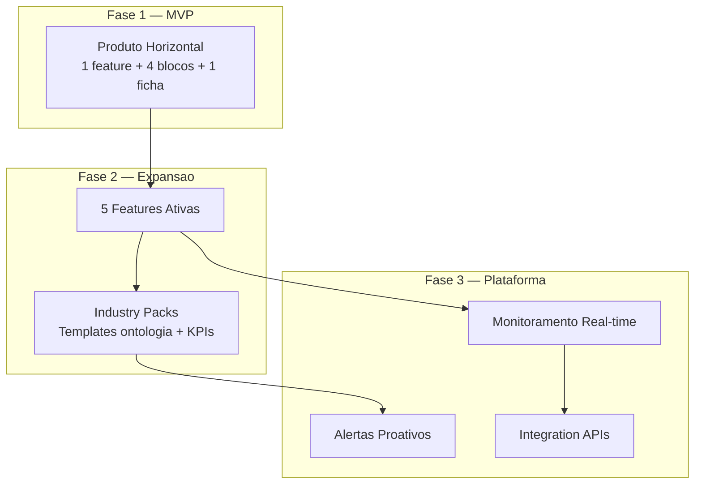
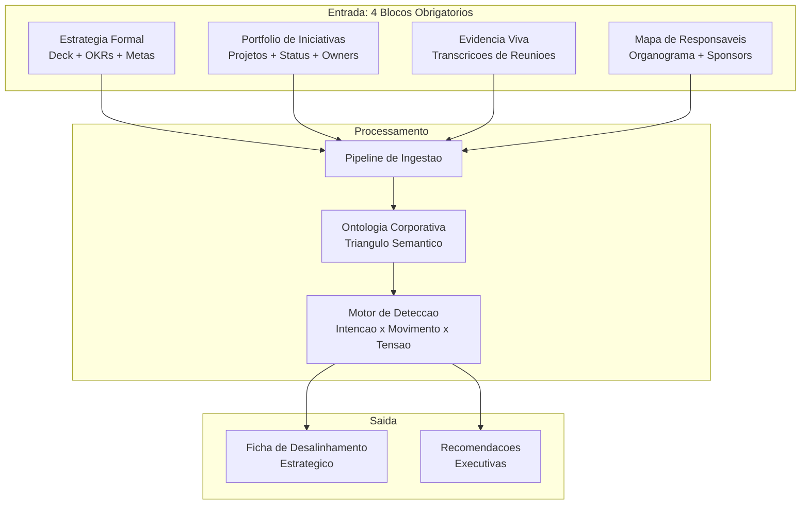
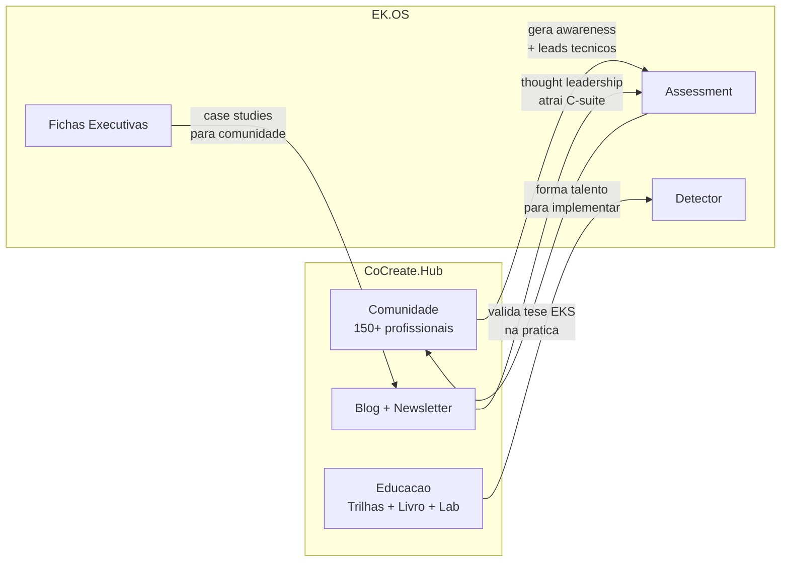

# Spec 001 — Estrategia de Produto: EK.OS

**Criado**: 2026-03-31 | **Status**: Draft
**Prioridade**: P0 | **Dependencias**: spec-000

---

## 1. Contexto e Problema

O EK.OS (Enterprise Knowledge Operation System) e o produto enterprise da CoCreate AI. Ele materializa a tese de Enterprise Knowledge Systems como produto vendavel para o C-suite.

**Pergunta central**: O produto deve ser vertical-especifico (por industria) ou holistico (universal)?

**Contexto de mercado**:
- ~20.000 empresas com 250+ funcionarios no Brasil
- CEOs investem em IA mas retornos ainda sao difusos
- Boards tem pouco repertorio para avaliar IA com profundidade
- Decisoes, governanca e dados confiaveis estao subindo para o centro da agenda executiva
- Grande maioria das empresas sofre de "estrategia em PowerPoint e execucao em silos"

---

## 2. Decisao Estrategica

### **Horizontal-First, Vertical-Ready**

O produto core e industry-agnostico. Verticais entram como camadas de configuracao (Industry Packs) a partir da Fase 2.

---

## 3. Justificativa

### 3.1 Por que Horizontal no Core

| # | Argumento | Evidencia |
|---|-----------|-----------|
| 1 | **Champion feature e industry-agnostico** | O Detector de Desalinhamento Estrategico funciona em qualquer empresa que tenha estrategia, projetos e reunioes — ou seja, todas |
| 2 | **Modelo de coleta e universal** | Os 4 blocos (estrategia, execucao, evidencia viva, accountability) existem em qualquer setor. Deck estrategico de banco e de varejista seguem padroes semanticos identicos |
| 3 | **5 features endereçam dores universais** | Qualidade de decisao, antecipacao de risco e aceleracao de execucao sao preocupacoes de todo board |
| 4 | **Proposta "4 evidencias" perde forca se verticalizar** | A venda e sobre friccao minima. Adicionar especificidade vertical na porta de entrada aumenta complexidade e contradiz o valor central |
| 5 | **Mercado brasileiro nao justifica fragmentacao prematura** | ~20K empresas com 250+ funcionarios. Verticalizacao precoce estreita um mercado ja finito |

### 3.2 Por que Vertical como Aceleracao (Fase 2+)

| # | Argumento | Mecanismo |
|---|-----------|-----------|
| 1 | **Templates de ontologia por setor aceleram onboarding** | Ex: termos regulatorios bancarios, taxonomia de saude, nomenclatura de manufatura |
| 2 | **Case studies verticais fortalecem narrativa de venda** | "Veja como desalinhamento se manifesta especificamente no seu setor" |
| 3 | **Bibliotecas de KPIs por setor adicionam relevancia** | Bloco 5 (Performance) ganha poder quando os indicadores sao do setor do cliente |

### 3.3 Por que NAO verticalizar no MVP

- Multiplica esforco de desenvolvimento sem base de validacao
- Cria expectativa de expertise setorial que ainda nao existe
- Fragmenta posicionamento: "fazemos tudo para bancos" vs "resolvemos cegueira gerencial"
- Dificulta contratacao de primeiros clientes (narrowing)

---

## 4. Arquitetura de Produto

### 4.1 Champion Feature: Detector de Desalinhamento Estrategico

**6 vantagens simultaneas**:
1. Fala a lingua do board, nao a lingua da tecnologia
2. Mostra valor sem exigir adocao comportamental massiva no dia 1
3. Usa ativos que a empresa ja tem: estrategia, projetos, reunioes, organograma
4. Evidencia por que um EKS e diferente de chatbot e de BI
5. Torna o grafo "invisivel" para o comprador e "indispensavel" para a entrega
6. Abre porta natural para expandir depois para risco, decisao, governanca e copilotos

### 4.2 As 5 Features Core

| # | Feature | Pergunta | Fase |
|---|---------|----------|------|
| 1 | **Detector de Desalinhamento Estrategico** | "Estamos executando a estrategia ou so produzindo atividade?" | MVP |
| 2 | **Radar Executivo de Risco e Oportunidade** | "Quais mudancas exigem atencao do board agora?" | Fase 2 |
| 3 | **Navegador de Impacto de Decisao** | "Se aprovarmos esta decisao, o que sera afetado?" | Fase 2 |
| 4 | **Cockpit de Governanca de IA** | "Onde estamos expostos e o que corrigir antes de escalar?" | Fase 2 |
| 5 | **Mapa de Dependencia Critica** | "Quais capacidades dependem demais de poucas pessoas?" | Fase 2 |

### 4.3 Modelo de Coleta de Dados: 5 Blocos por Custodiante

| Bloco | Responsavel | Uploads | Obrigatorio |
|-------|-------------|---------|-------------|
| **1. Estrategia** | CEO office, estrategia, PMO executivo | Deck estrategico, OKRs/metas, prioridades corporativas | Sim |
| **2. Execucao** | PMO, lideres de programas | Portfolio de projetos, status report, roadmap | Sim |
| **3. Evidencia Viva** | Presidencia, diretoria, PMO | Transcricoes, atas, resumos executivos | Sim |
| **4. Accountability** | RH estrategico, PMO, operacao executiva | Organograma simplificado, sponsors, donos de iniciativas | Sim |
| **5. Performance** | Controladoria, financas, BI executivo | Indicadores executivos, relatorio mensal | Opcional (alto valor) |

**Dinamica**: Em vez de pedir colaboracao da empresa inteira, pedimos **5 uploads de 4 areas especificas**. Isso muda completamente a percepcao de atrito.

### 4.4 Ficha de Desalinhamento Estrategico (Output)

| Campo | Descricao |
|-------|-----------|
| Prioridade estrategica declarada | O que a empresa disse que e prioridade |
| Iniciativas vinculadas | Projetos que supostamente suportam essa prioridade |
| Evidencias extraidas | Trechos de reunioes, documentos, status reports |
| Tensoes e contradicoes | Conflitos entre intencao e movimento |
| Lacunas de ownership | Prioridades sem dono claro |
| Riscos emergentes | Sinais de risco nas evidencias |
| Sinais de desvio de foco | Indicadores de atencao em outro lugar |
| Areas impactadas | Quais areas sao afetadas |
| Intensidade do desalinhamento | Baixo / medio / alto / critico |
| Grau de evidencia | Forca da base de dados para a afirmacao |
| Recomendacoes executivas | Acoes sugeridas para o board |

---

## 5. Fases do Produto

### Fase 1 — MVP: Assessment + Ficha

**Escopo**:
- 1 champion feature: Detector de Desalinhamento Estrategico
- 4 blocos de coleta obrigatorios + 1 opcional
- 1 output: Ficha de Desalinhamento Estrategico
- Multi-tenant basico (1 empresa = 1 tenant)
- Interface web para upload e visualizacao da ficha

**Criterios de sucesso**:
- [ ] Assessment end-to-end funcional (upload → processamento → ficha)
- [ ] Ficha gera achados acionaveis a partir de dados reais
- [ ] Executivo consegue entender a ficha sem explicacao tecnica
- [ ] Tempo de assessment < 2 semanas (coleta + processamento)

### Fase 2 — Expansao: 5 Features + Industry Packs

**Escopo**:
- 5 features ativas (Detector + Radar + Navegador + Cockpit + Mapa)
- Industry Packs: templates de ontologia + bibliotecas de KPIs por setor
- Monitoramento periodico (nao apenas one-shot assessment)
- Dashboard executivo consolidado

**Verticais iniciais para Industry Packs**:

| Vertical | Justificativa |
|----------|--------------|
| **Financeiro** (bancos, seguradoras) | Alta maturidade de governanca, compliance forte, budget para IA, dados estruturados |
| **Saude** | Regulacao pesada, riscos criticos, dependencia de conhecimento humano |
| **Industria/Manufatura** | Operacao complexa, cadeia de dependencias, OKRs claros |

### Fase 3 — Plataforma: Inteligencia Continua

**Escopo**:
- Monitoramento real-time (ingestao continua de evidencias)
- Alertas proativos (notificacoes ao board quando desalinhamento piora)
- Integration APIs (conectar a ferramentas existentes: Jira, Monday, Slack, Teams)
- Copilotos especializados (assistentes por feature)

---

## 6. Posicionamento Comercial

### 6.1 Narrativa Central

**Nao vender** "Enterprise Knowledge System" na primeira conversa.
**Vender** uma **maquina de reducao de cegueira gerencial**.

O board nao compra "grafo", "ontologia" nem "hub de conhecimento". Ele compra:
1. **Capacidade de decidir melhor**
2. **Antecipacao de risco**
3. **Aceleracao de execucao**

### 6.2 Oferta Comercial em 3 Camadas

| Camada | Nome | Escopo | Valor |
|--------|------|--------|-------|
| **1. Assessment** | Diagnostico de Alinhamento Estrategico | Coleta 4 blocos + processamento + entrega ficha | Prova de valor. Baixa friccao. |
| **2. Implementacao** | EK.OS Deployment | Sistema completo com 5 features + monitoramento | Valor recorrente. Contrato anual. |
| **3. Continuo** | Inteligencia Organizacional as a Service | Real-time + alertas + integracoes + suporte | Retencao. Expansao dentro do cliente. |

### 6.3 Frase Comercial

> "Quatro evidencias corporativas que ja existem hoje e que nos permitem mostrar, com rastreabilidade, onde a execucao da empresa esta desalinhada da estrategia."

### 6.4 Posicionamento vs. Alternativas

| Alternativa | Por que EK.OS e diferente |
|-------------|--------------------------|
| **BI/Dashboard** | BI mostra o que voce pergunta. EK.OS mostra o que voce nao sabe que precisa saber. |
| **Chatbot/Copilot** | Chatbot responde perguntas. EK.OS gera entregas proativas sem ser perguntado. |
| **Consultoria estrategica** | Consultoria entrega um relatorio por trimestre. EK.OS entrega inteligencia continua. |
| **Project Management** | PM gerencia tarefas. EK.OS cruza tarefas com estrategia e evidencia que o todo esta desalinhado. |

---

## 7. Mercado-Alvo Brasil

### 7.1 Segmento Primario

- **Empresas medias-grandes**: 250+ funcionarios, faturamento > R$100M/ano
- **Com estrategia formal**: Tem deck/OKRs/planejamento (nao startups early-stage)
- **Com dor de execucao**: Investem em transformacao mas sentem que "nada acontece"
- **Board minimamente digital**: Usam ferramentas, gravam reunioes, tem PMO

### 7.2 Segmento Secundario (expansao)

- Empresas com 100-250 funcionarios em crescimento acelerado
- Multinacionais com operacao Brasil
- Grupos empresariais com multiplas unidades de negocio

---

## 8. Relacao com CoCreate.Hub

| Aspecto | CoCreate.Hub | EK.OS |
|---------|-------------|-------|
| **Persona** | Profissionais tecnicos e de negocios | C-suite, board, diretoria |
| **Modelo** | Freemium (Free/Premium/Business) | B2B enterprise (Assessment → Contrato) |
| **Receita** | Subscricao + cursos | Assessment fee + licenca anual |
| **Conexao** | Hub gera leads e talent pool | EK.OS gera receita e valida tese |

---

## 9. Riscos e Mitigacoes

| Risco | Probabilidade | Impacto | Mitigacao |
|-------|--------------|---------|-----------|
| Produto abstrato demais para mercado BR | Media | Alto | Assessment-first com ficha tangivel como output |
| Friccao na coleta de dados | Media | Alto | Modelo 4 blocos por custodiante, sem onboarding massivo |
| Confusao com BI/chatbot | Alta | Medio | Posicionamento "inteligencia proativa" + demonstracao pratica |
| Qualidade da ontologia insuficiente | Media | Critico | Ontologia do Triangulo Semantico como nucleo, validacao com dados reais |
| Multi-tenancy complexo | Baixa | Alto | Neo4j labels por tenant, isolamento desde o inicio |
| Competicao com consultorias | Media | Medio | Automacao + evidencia continua vs. relatorio trimestral manual |

---

## 10. Criterios de Aceitacao da Spec

- [ ] Decisao estrategica (horizontal-first) documentada e justificada
- [ ] 5 features core definidas com perguntas e fases
- [ ] Modelo de coleta (5 blocos) especificado com custodiantes
- [ ] Ficha de Desalinhamento detalhada como output
- [ ] Fases do produto (MVP → Expansao → Plataforma) claras
- [ ] Posicionamento comercial em 3 camadas definido
- [ ] Relacao com CoCreate.Hub mapeada
- [ ] Riscos e mitigacoes identificados
